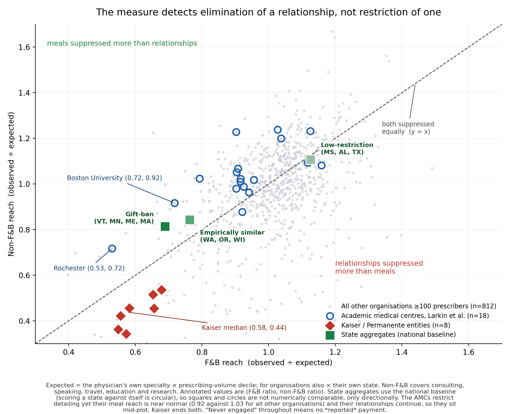

# Open Payments White Space

**Which US physicians has the pharmaceutical industry never reached, and what does trying to answer that reveal about the database everyone uses to study it?**

I linked four federal healthcare datasets (35 GB, 71 million payment records, 1.4 million prescribers) to characterize a population the literature has only ever used as a control group. My first headline was inflated twentyfold and I found that by attacking it. What survived is a validated two-axis measure that separates two situations the database conflates, tested blind against an external labelled set with complete separation.

Everything runs on public files. The full pipeline reproduces every headline figure in 12 seconds.



- **21.02%** of MD/DO Medicare Part D prescribers have never received a reported industry payment
- **58.7%** of engaged physicians received only meals. Median footprint: 16 payment records, $705 across five years
- **76.7%** of the variance in non-engagement is unexplained by specialty, geography, practice size, and organization combined

| | |
|---|---|
| **Data** | Open Payments, NPPES, Medicare Part D, CMS Doctors and Clinicians |
| **Population** | 696,647 MD/DO Medicare Part D prescribers |
| **Window** | Covered-recipient roster PY2013 to PY2025, channel detail PY2021 to PY2025 |
| **Stack** | DuckDB over Parquet, Python for figures |
| **Runtime** | 12 seconds end to end |

---

## The problem

Open Payments is the federal record of every payment from drug and device manufacturers to US physicians. It has been public since 2013 and is heavily used. Nearly every study asks the same question: does taking industry money change what a doctor prescribes? Physicians who take money are the subject. Physicians who don't are the control group.

In one widely cited 2016 linkage, 379,035 prescribers were set aside in a single clause, "presumed to have received no payments," and never mentioned again.

Nobody had turned around and described them.

---

## Findings

**1. The white space is real and mostly not worth having.**
17,108 never-engaged physicians sit in the top two prescribing-volume deciles, writing 97.9 million claims worth $8.21 billion. But only 553 of them also prescribe at high cost per claim. The other 96.8% are high-volume generic prescribers, which is what a selection story predicts. Industry did not overlook them. Industry declined them.

The selection-robust group is 553 physicians and $924 million, or 553 to 3,896 physicians and $0.9 to $3.0 billion depending on threshold. No cut point is principled, so the range is the honest answer.

**2. Open Payments predominantly measures the meal channel.**
58.7% of engaged physicians have food-and-beverage payments and nothing else. Median engaged physician: 16 records, $705 over five years, about $141 a year.

**3. Single-year windows inflate that to 74.86%.**
Non-meal relationships are episodic. A consultant paid every other year looks meal-only in the off years. Any single-program-year channel analysis systematically over-classifies physicians as meal-only.

**4. Cross-state differences are real but inflated roughly sixfold by that channel.**
Reclassifying meal-only physicians compresses the state spread from 8.4x to 1.30x, but the ordering holds (Spearman rho = 0.845). Gift-ban states genuinely have less industry engagement. The raw database overstates how much less.

**5. A two-axis channel measure separates surviving relationships from eliminated ones.**
Vermont bans the gift, so a representative may still detail a physician but not buy lunch. Kaiser Permanente does not permit representatives into its facilities at all. Both produce zeros in the database. On two axes they separate: relationship-only runs 6.42% in Vermont against 0.15% in Mississippi, while Kaiser shows non-food reach of 5.6% to 13.5% against a 30.71% national rate, in all eight entities across seven states.

**Validated blind.** Larkin et al. (*JAMA* 2017) identified 19 academic medical centers with documented detailing restrictions, coded by policy content. Scored against that external set with no tuning: 18 AMCs median 1.110 (range 0.932 to 1.360), 8 Kaiser entities median 0.727 (range 0.557 to 0.794). Complete separation, zero overlap across 26 units, robust to removing research payments.

The AMCs turned out to be the control rather than the positive case. Seventeen of nineteen had written access restrictions and still look ordinary on the measure, which is what establishes that it detects whether a commercial relationship survives rather than what a policy document says.

**6. Non-engagement is not predictable from public data.**
Specialty, state, rurality, practice size, and organization leave 76.7% of variance unexplained out of sample. Non-engagement clusters strongly within organizations, at 26.9 times the variance independence would produce, but 261 organizations holding 15.8% of physicians carry essentially the entire effect.

**7. Payment categories must not be summed.**
Research payments total $32.95 billion with a median of $88,238 per physician, against a $705 five-year median for general payments. Two orders of magnitude apart per head while barely changing reach. That money funds institutional trial work.

---

## What this does not claim

**"Never engaged" means "never received a reported transfer of value."** Drug samples are not reportable under the Sunshine Act. A representative can visit a physician, leave samples, and generate no record anywhere. This is a ceiling on what the analysis can say, not a footnote.

**Selection versus treatment is unresolved.** Whether never-engaged physicians prescribe generics because industry avoided them, or the reverse, cannot be determined here. Five program years now make a within-physician design feasible. I did not run it.

**The two-axis measure is group-level.** A single physician with no records cannot be assigned to a mechanism.

**No legal classification is applied anywhere.** State groupings are empirical. Their overlap with statutory gift-ban regimes is observed, not assumed, and the empirical and legal groupings disagree for at least one state.

**Part D is Medicare only**, covering roughly two-thirds of Medicare beneficiaries, with no commercial or Medicaid volume.

**Channel classification covers PY2021 to PY2025.** Open Payments begins in 2013, so physicians engaged only before 2021 cannot be channel-classified. That is 5.85% of the ever-engaged.

---

## Method

The linkage most of this literature treats as unavailable turns out not to be. CMS documentation, an HHS open-data ticket closed as "Not possible," and several published papers all state that Open Payments does not contain NPIs. That is true of the payment detail files and false of the Covered Recipient Profile Supplement, which carries the identifier fully populated. No entity resolution was required.

The Profile Supplement was verified comprehensive rather than assumed: of 770,465 physicians paid in program year 2021, zero are absent from it. Of 59,213 NPIs appearing anywhere in five years of research payments, two.

Analysis is descriptive throughout. Where a model appears, in the out-of-sample variance decomposition, it is split-half with shrunk estimates and reported as such.

---

## Reproducing

```bash
# 1. Download the sources from CMS (URLs in scripts/00_convert_to_parquet.sh)
bash scripts/00_convert_to_parquet.sh
bash scripts/run_all.sh
```

`run_all.sh` rebuilds every derived table and prints the headline figures for verification against this README.

Requires DuckDB 1.5.5 or later on PATH (or set `DUCKDB=/path/to/duckdb`) and Python 3 with `matplotlib` and `pandas`. About 12 seconds from converted Parquet.

---

## Corrections made during the work

Recorded because the corrections are part of the result.

- An initial scope decision (dermatology) was rejected. At roughly 1.5% hospital employment, the practice-ownership predictor has almost no variance in that specialty, so the design could not have tested its own mechanism.
- A one-year channel analysis concluded the state effect was largely an artifact (Spearman rho = 0.121, Mississippi moving from lowest to near-highest). Five years of data overturned it: rho = 0.845, Mississippi rank 40 of 52. The magnitude compresses. The ordering does not.
- A cost-per-claim gap reported as a prescribing-behavior difference proved roughly 69% specialty composition once standardized.
- An out-of-sample result showing organization degrading predictive accuracy was a null-handling bug. 11,110 held-out physicians received a floor probability because `greatest()` skips NULLs. Corrected, organization adds rather than subtracts.
- Research payments were absent from the channel classification until the final phase. In the research files, 54,119 physicians appear only in principal-investigator fields against 16,210 as covered recipients. Querying the obvious field alone would have tested a quarter of the population and returned a confidently wrong answer.
- Volume deciles were assigned with `NTILE(10) OVER (ORDER BY tot_clms)`. That ordering is not unique: 99.2% of MD/DOs share a claim count with at least one other physician and the largest tie group is 5,687. 1,838 physicians (0.26%) changed decile between runs of the identical query, enough to move two reported medians by 0.001. Fixed with a deterministic tiebreaker.
- Two CSV exports lacked an `ORDER BY`. With parallel execution and `preserve_insertion_order=false`, DuckDB emitted rows in a different order on each run. Values were identical when sorted, but the files differed byte for byte, and one figure redrew its overplotting order. The same class of defect as the `NTILE` tie problem above: an unordered operation over a parallel scan. Fixed by adding explicit ordering.

---

## Files

```
scripts/    runnable pipeline, numbered in order
figures/    three figures with generating code and data exports
findings/   nine phase documents, including superseded results
tasks/      the task specifications each phase was run against
```

The findings documents retain superseded numbers with corrections marked. They are the record of how the conclusions were reached, not a clean narrative.

---

## Tooling

DuckDB over Parquet, Python for figures. Analysis was directed and reviewed by the author, with Claude and Claude Code used for execution and code generation. Every headline figure was independently re-verified against the data after being written.
